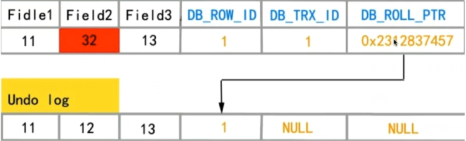
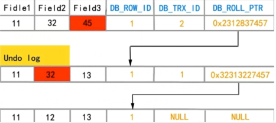

## 常用命令

```shell
# 检测状态
sudo service mysql status
# 停止mysql
sudo service mysql stop
# 启动mysql
sudo service mysql start

# 创建新用户
create user 'username'@'allowedhost' identified by 'password'; # 全部IP则为 %

# 创建数据库
create database basename;

# 授权
# all 可以替换为 select,delete,update,create,drop
grant all privileges on 'dbname'.* to 'username'@'allowedhost'  # dbname下所有表


# 刷新权限
flush privileges;
```


## 安装

Ubuntu Server APT install

1. 下载文件，[apt下载地址](https://dev.mysql.com/downloads/repo/apt/)。

2. 上传并设置文件，选择你要安装的内容版本和方式。

   ```shell
   sudo dpkg -i /PATH/version-specific-package-name.deb
   ```

3. 更新包信息

   ```shell
   sudo apt-get update
   ```

4. 联网状态下安装mysql

   ```shell
   sudo apt-get install mysql-server
   ```

5. 按照提示安装

   * 安装mysql8.0版本的时候，密码验证方式可以选择新的密码方式和老得传统的5.X版本的方法。

6. 使ROOT用户可以远程登录

   ```sql
   mysql -u root -p //ssh连接数据库
   
   use mysql // 切换到mysql数据库的库
   
   select user,host from user; //查询当前用户
   
   update user set host = '%' where user =  'root'; // 修改root用户，允许远程登录。
   
FLUSH PRIVILEGES; // 刷新权限
   ```
   
   

## 笔记

### 数据引擎的对比

#### 对比

|                   | InnoDB                                                       | MyISAM                                                       |
| ----------------- | ------------------------------------------------------------ | ------------------------------------------------------------ |
| 锁                | 表锁、行级锁                                                 | 只支持表级锁                                                 |
| 事务              | 支持                                                         | 不支持                                                       |
| 自增              | 自增列必须是索引，如果是组合索引也必须是组合索引的第一列。   | 自增列必须是索引，如果是组合索引，自动增长可以不是第一列，他可以根据前面几列进行排序后递增。 |
| 主键              | 如果没有设定主键或者非空唯一索引，就会自动生成一个6字节的主键。 | 允许没有任何索引和主键的表存在。                             |
| count()函数       | 没有保存表的总行数，要全表扫描。                             | 保存有表的总行数，直接取值返回。                             |
| 全文索引          | 不支持FULLTEXT类型的全文索引，可以使用sphinx插件实现。       | 支持 FULLTEXT类型的全文索引。                                |
| delete from table | 不会从新建立表，而是一条一条的删除数据。清空数据可以使用truncate。 | 创建新表。                                                   |
| 外键              | 支持                                                         | 不支持                                                       |
| MVCC              | 支持                                                         | 不支持                                                       |

#### 适用场景

MyISAM适合：

1. 做很多count 的计算。
2. 插入不频繁，查询非常频繁。
3. 没有事务。

InnoDB适合：

1. 可靠性要求比较高，或者要求事务。
2. 表更新和查询都相当的频繁，并且表锁定的机会比较大的情况。


### 数据库事务的四大特性

原子性  A(Atomic)  操作全部成功或全部回滚，不可分割。

一致性  C(Consistency) 数据回滚后与之前一致。

隔离性  I(Isolation)  多事物之间没有影响。

持久性  D(Durability)  已经提交的事物应永远不再被本次事物中改变。


### session页面中可以使用命令来手动事务。

```sql
start transaction
commit
rollback 
```


### 慢SQL查询

在CMD中查询和开启相关设置，也可以在MYSQL配置文件中设置来开启。

```sql
show variables like '%query%';
show status like '%slow-queries%';
slow_query_log /* 默认是OFF */
set global show_query_log = ON /* 打开慢查询日志开关 */
slow_query_log_file
long_query_time  /* 慢查询的时间阈值 */
```


### 各事务级别下的并发访问会产生的问题

|            | 问题描述                                                     | 如何避免                                                     |
| ---------- | ------------------------------------------------------------ | ------------------------------------------------------------ |
| 更新丢失   | 事务A修改了查询存款额为100元，且更新其80元，事务B查询存款额为100元，更新其为120提交。但事务A回滚，存款额变为100元。 | mysql所有事务在数据库上可以避免。read-uncommit及以上都可以避免。 |
| 脏读       | 事务A读取了事务B更新的数据，然后B回滚操作，那么A读取到的数据是脏数据 | read-commit及以上可以避免。                                  |
| 不可重复读 | 事务 A 多次读取同一数据，事务 B 在事务A多次读取的过程中，对数据作了更新并提交，导致事务A多次读取同一数据时，结果 不一致。 | repeatable-able及以上可以避免。                              |
| 幻读       | 系统管理员A将数据库中所有学生的成绩从具体分数改为ABCDE等级，但是系统管理员B就在这个时候插入了一条具体分数的记录，当系统管理员A改结束后发现还有一条记录没有改过来，就好像发生了幻觉一样，这就叫幻读。 | serializable级可以避免                                       |

 **小结： 在可重复读中，该sql第一次读取到数据后，就将这些数据加锁，其它事务无法修改这些数据，就可以实现可重复读了。但这种方法却无法锁住insert的数据，所以当事务A先前读取了数据，或者修改了全部数据，事务B还是可以insert数据提交，这时事务A就会发现莫名其妙多了一条之前没有的数据，这就是幻读，不能通过行锁来避免。需要Serializable隔离级别 ，读用读锁，写用写锁，读锁和写锁互斥，这么做可以有效的避免幻读、不可重复读、脏读等问题，但会极大的降低数据库的并发能力。 **

```sql
select @@tx_isolation /* 查询当前会话的事务等级 */
/*set session transaction isolation level  "等级"   设置会话的事务隔离等级 */
SET session transaction isolation level read committed;
```


### InnoDB 如何在可重复读(RR)下避免幻读

表象：快照读（非阻塞） =》 伪MVCC ( Multi-Version Concurrent Controll多版本并发控制 )

实际：使用next-key锁（行锁+GAP锁）

在MVCC中：

- 快照读：就是select
  - select * from table ....;
- 当前读：特殊的读操作，插入/更新/删除操作，属于当前读，处理的都是当前的数据，需要加锁。
  - select * from table where ? lock in share mode;
  - select * from table where ? for update;
  - insert;
  - update ;
  - delete;


### RC\RR下InnoDB的非阻塞读如何实现

#### 隐藏字段

- DB_TRX_ID
  最新一次修改本行记录的**操作**ID
  **同一个事务，同一个操作要加以区分，这里指操作**
- DB_ROLL_PTR
  回滚指针，存储的地址配合undo log
- DB_ROW_ID
  InnoDB 无论有没有主键，都会通过该字段唯一标识一条记录

#### undo log

1. 假设Session A 修改字段 **Field2 12 -> 32**,  ， 首先会对该行数据加上 写锁 （也叫排他锁）。  DB_TRX_ID = NULL + 1，标识是 Session A 的一修改**操作** ; 然后将 Field2 12 的信息拷贝至 undo log , 用回滚指针指向undo log 刚创建的记录 

   

2. 并发情况下，Session B 修改  **Field3 13 -> 45**  , 发现DB_TRX_ID = 1，证明已有其他事务操作过，利用DB_TRX_ID = DB_TRX_ID + 1 标识 Session B 的操作。多事务并发操作下，DB_TRX_ID递增，回滚指针 DB_ROLL_PTR 指向 undo log的数据，形成链表的数据结构。

   


#### read view（快照）

算法简略描述：

1. 操作某条记录，先生成DB_TRX_ID。将自身记录的 DB_TRX_ID 与 当前活跃事务 的 DB_TRX_ID 进行比较

2. 找到 DB_TRX_ID >= 当前活跃事务操作 的DB_TRX_ID 的上边界，比如 undo log 内有 DB_TRX_ID = 4, 3 ,2 ,1; 而当前的DB_TRX_ID 为 3，则上边界为3。

3. 使用上边界，找到undo log 的记录，读取其所有Field的记录，当且仅当能看到并能修改上边界为3所暂存的记录。

   

#### RC、RR 快照读的不同

READ-COMMITTED
一个事务下，RC 每条 dml 语句（增删改查）读数据都会创建一个新的 read view （快照），其DB_TRX_ID 每次读都 +1。

REPEATABLE-READ
一个事务下，RR 第一条 dml 语句（增删改查）读数据会对已存在的 undo log 按read view的规则创建一个快照。同一个事务下，多次执行dml 语句，也是只能读到同一个快照，即第一个快照的内容。


### 对主键索引或者唯一索引会用GAP锁么？

where条件全部命中，则不需要GAP锁，只会加记录锁。

where条件部分命中或者全不命中，则添加GAP锁。只会锁定部分where中的index有序从小到大整个范围。

补：非唯一索引或不走索引的当前读中，会使用GAP锁。

ex:

GAP锁  在index为 2 ，6 ，9，11，15

GAP区间为（-∞,2 ], ( 2, 6 ], (6, 9], (9, 11], (11, 15], (15,+∞)


### 锁的分类

| 划分方式 | 种类             |
| -------- | ---------------- |
| 粒度     | 表级、页级、行级 |
| 级别     | 共享锁、排他锁   |
| 加锁方式 | 自动、显示       |
| 操作     | DML锁、DDL锁     |
| 使用方式 | 乐观锁、悲观锁   |


### 索引