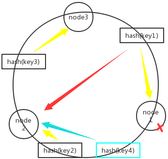
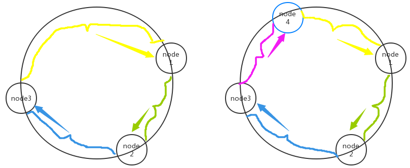
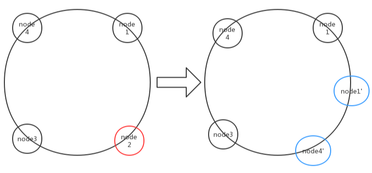

## 常用文档

[文档首页](https://redis.io/documentation)

[命令行](https://redis.io/commands)

[PUB/SUB](https://redis.io/topics/pubsub)

[分布式锁](https://redis.io/topics/distlock) / [redisson-Java的分布式锁实现](https://github.com/redisson/redisson) 

[事物](https://redis.io/topics/transactions)

[淘汰方法](https://redis.io/topics/lru-cache)


## 常用命令

```shell
redis手工启动和关闭
路径：安装目录/src 
redis-server ../redis.conf 使用该配置文件启动
redis-cli shutdown 关闭redis运行

redis-cli 客户端控制台，包含参数：
	-h xxx 指定服务端地址，缺省值是127.0.0.1
	-p xxx 指定服务端端口，缺省值是6379
```


## 安装

1. 下载路径：[Redis](https://redis.io/download)

2. 解压文件包

   ```shell
    tar -xvf redis-5.0.5.tar.gz
   ```

3. 安装依赖

   ```shell
   sudo apt install make
   sudo apt install gcc
   ```

4. 编译安装

   ```shell
   make && make install # 进入到目录后
   ```

5. 修改配置文件

   ```shell
   vim redis.conf # 在安装目录下
   
   #bind 127.0.0.1 # 将这行代码注释，监听所有的ip地址，外网可以访问
   protected-mode no # 把yes改成no，允许外网访问
   daemonize yes # 把no改成yes，后台运行
   ```


## 数据结构

### String: 字符串

string 是 redis 最基本的类型，一个 key 对应一个 value。

由sdshdr，C语言的动态字符串实现。

```shell
redis 127.0.0.1:6379> SET demostring "gu6s"
OK
redis 127.0.0.1:6379> GET demostring
"gu6s"
```


### Hash: 散列

Redis hash 是一个键值(key=>value)对集合。

Redis hash 是一个 string 类型的 field 和 value 的映射表，hash 特别适合用于存储对象。

哈希对象的编码可以是 ziplist (压缩列表)或者 hashtable。

```shell
redis 127.0.0.1:6379> HMSET demohash field1 "Hello" field2 "World"
"OK"
redis 127.0.0.1:6379> HGET demohash field1
"Hello"
redis 127.0.0.1:6379> HGET demohash field2
"World"
```


### List: 列表

Redis 列表是简单的字符串列表，按照插入顺序排序。

列表对象的编码可以是 ziplist(压缩列表) 和 linkedlist(双端链表)。

```shell
redis 127.0.0.1:6379> lpush demolist redis
(integer) 1
redis 127.0.0.1:6379> lpush demolist mongodb
(integer) 2
redis 127.0.0.1:6379> lpush demolist rabitmq
(integer) 3
redis 127.0.0.1:6379> lrange demolist 0 10
1) "rabitmq"
2) "mongodb"
3) "redis"
```


### Set: 集合

Redis 的 Set 是 string 类型的无序集合

集合对象的编码可以是 intset (整数集合)或者 hashtable

```shell
redis 127.0.0.1:6379> sadd demoset redis
(integer) 1
redis 127.0.0.1:6379> sadd demoset mongodb
(integer) 1
redis 127.0.0.1:6379> sadd demoset rabitmq
(integer) 1
redis 127.0.0.1:6379> sadd demoset rabitmq
(integer) 0
redis 127.0.0.1:6379> smembers demoset

1) "redis"
2) "rabitmq"
3) "mongodb"
```


### Sorted Set: 有序集合

Redis zset 和 set 一样也是string类型元素的集合,且不允许重复的成员。

不同的是每个元素都会关联一个double类型的分数。redis正是通过分数来为集合中的成员进行从小到大的排序。

zset的成员是唯一的,但分数(score)却可以重复。

有序集合的编码可以是 ziplist 或者 skiplist(跳跃表)。

```shell
  redis 127.0.0.1:6379> zadd demosortset 0 redis
  (integer) 1
  redis 127.0.0.1:6379> zadd demosortset 0 mongodb
  (integer) 1
  redis 127.0.0.1:6379> zadd demosortset 0 rabitmq
  (integer) 1
  redis 127.0.0.1:6379> zadd demosortset 0 rabitmq
  (integer) 0
  redis 127.0.0.1:6379> > ZRANGEBYSCORE demosortset 0 1000
  1) "mongodb"
  2) "rabitmq"
  3) "redis"
```


## 持久化

### RDB

是redis的默认方式：在一定间隔时间或一定数量变化的时候进行持久化。

在命令行中使用`save`命令和`bgsave`命令来保存，两者区别在于是不是后台运行,`save`命令会占据当前线程（主线程）从而阻塞当前Redis服务器不能处理其他命令。`bgsave`只在fork时候阻塞一下。

#### 设置

在redis.conf 配置文件中的 SNAPSHOTTING 下有几行：

```shell
save 900 1      # 表示900 秒内如果至少有 1 个 key 的值变化，则保存
save 300 10
save 60  10000

stop-writes-on-bgsave-error  #默认值为yes。启用了RDB且最后一次后台保存数据失败，Redis是否停止接收数据。

rdbcompression # 默认值是yes。对于存储到磁盘中的快照是否进行压缩存储。会采用LZF算法进行压缩。

rdbchecksum # 默认值是yes。在存储快照后，让redis使用CRC64算法来进行数据校验。

dbfilename # 设置快照的文件名，默认是 dump.rdb

dir # 设置快照文件的存放路径，这个配置项一定是个目录，默认是和当前配置文件保存在同一目录。
```

#### 优点

使用一个子进程来处理（bgsave），大量恢复数据的时候比AOF模式要快。

#### 缺点

没有办法做实时性高的备份，发生意外停机后，丢失从当前到上一次持久化的数据。

#### 原理简析

在redis中有一个数据结构保存着修改计数器和上次执行save的时间。将配置文件中的写入的save命令存在一个数组汇总，节点包含设定修改数和设定秒数。redis服务本身有一个 周期性操作函数 severCron 每100ms执行一次，若有任一条件满足，就执行。

执行`bgsave`时，先检测是否已有子进程进行中(包括RDB和AOF进程)，若可以出发则调用`rdbsavebackground`。在copy-in-write模式下，子进程fork主进程执行复制作业。主进程继续响应业务。

#### 触发方式：

* redis.config中设置的save
* 主从复制，主节点自动触发
* 执行Debug Reload
* 执行shutdown且未开启AOF模式


### AOF

使用日志记录每一个操作的命令

异常修复命令：redis-check-aof --fix 进行修复 

#### 设置

在 redis.conf 配置文件的 APPEND ONLY MODE 下：

```shell
appendonly # 修改为 yes，默认是no

appendfsync：
	no  # 表示不执行fsync，由操作系统保证数据同步到磁盘，速度最快，但是不太安全；
	always # 表示每次写入都执行fsync，以保证数据同步到磁盘，效率很低；
	everysec # 表示每秒执行一次fsync，可能会导致丢失这1s数据。通常选择 everysec。

appendfilename # aof文件名，默认是"appendonly.aof"

no-appendfsync-on-rewrite # 在aof重写或者写入rdb文件的时候,大量IO对于everysec和always造成阻塞过长时间,延迟要求很高的应用，这个字段可以设置为yes

auto-aof-rewrite-percentage # 默认值为100。aof自动重写配置。目前aof文件大小超过上一次重写的aof文件大小的百分之多少进行重写。

auto-aof-rewrite-min-size # 64mb。设置允许重写的最小aof文件大小，避免了达到约定百分比但尺寸仍然很小的情况还要重写。

aof-load-truncated # 默认值为 yes。aof文件在异常后可能尾部是不完整的，如果选择的是yes，当截断的aof文件被导入的时候，会自动发布一个log给客户端然后load。如果是no，用户必须手动redis-check-aof修复AOF文件才可以。
```

#### 优点

多种同步频率 ， 默认 每秒同步一次 。 AOF 文件使用 Redis 命令追加的形式 ，易读且 容易修正 。

#### 缺点

 AOF 文件通常会比 RDF 文件体积更大 。 负载较高时，RDB 比 AOF 具好更好的性能保证 。

#### 原理简析

 AOF持久化不断将写命令记录到 AOF 文件 ，当AOF文件的大小超过所设定的阈值时，Redis就会启动AOF文件的内容压缩，只保留可以恢复数据的最小指令集。可以使用命令 bgrewriteaof 来重写。

#### 重写的注意点

AOF 文件重写并不是对原文件进行重新整理，而是直接读取服务器现有的键值对，然后用一条命令去代替之前记录这个键值对的多条命令，生成一个新的文件后去替换原来的 AOF 文件。 

重写使用子进程携带数据副本，用缓冲区来保证复制副本后，更新的操作随后的写入。这样提供服务的主进程可以继续服务，同时保证AOF的工作和减小了对主进程的影响。


### 混合持久化

使用RDB恢复会丢失很多数据，单纯使用AOF模式会很慢。

 Redis 4.X 后，更新了一个RDB+AOF命令的文件来实现快速稳健的数据持久化方法。

#### 设置

配置文件中

```shel
aof-use-rdb-preamble yes   
```

#### 流程简析

AOF根据配置规则在后台自动重写aof文件，也可以人为执行命令`bgrewriteaof`重写AOF。 于是在Redis重启的时候，可以先加载rdb的内容，然后再执行aof指令部分达到Redis数据重放的目的。

`bgrewriteaof`启动后会检测是否有AOF或者RDB进程在执行。

若是没有则调用`rewirteAppendOnlyFileBackground`从主进程fork一个子进程，重写一个新的AOF文件，同时主进程讲重写启动后新的命令写入aof-rewrite-buf缓冲区中。同时旧的文件在替换前也会持续写入新的命令，来保证可用性。

当重写进程完成过后，将新的AOF文件更名替换旧的的文件。


## 主从备份

### 主从设置

主从机制第一个用途是保持高可用，第二个用途是将redis的读写分离。

设置方法:

在redis-cli中：

```shell
info replication # 查询节点信息：role字段会显示为Master还是Slave.

SLAVEOF 127.0.0.1 6379  # 在子节点的cli中为其指定一个地址和端口的redis为Master进入Slave模式。

# 执行完成在Master节点中查看节点信息可以看到子节点信息。表示设置成功。
# 使用命令行的设置方式在重启后将失效
```

在redis.conf文件中配置:

```shell
slaveof 127.0.0.1 6379  # 在子节点的配置文件中添加主节点信息来实现永久关系。
```

子节点配置：

```shell
slave-serve-stale-data # 默认值为yes。当一个 slave 与 master 失去联系，或者复制正在进行的时候，slave 可能会有两种表现：1) 如果为 yes ，slave 仍然会应答客户端请求，但返回的数据可能是过时，或者数据可能是空的在第一次同步的时候。2) 如果为 no ，在你执行除了 info he salveof 之外的其他命令时，slave 都将返回一个 "SYNC with master in progress" 的错误

slave-read-only # 配置Redis的Slave实例是否接受写操作，即Slave是否为只读Redis。默认值为yes。

repl-diskless-sync # 主从数据复制是否使用无硬盘复制功能。默认值为no。

repl-diskless-sync-delay # 当启用无硬盘备份，在设置的时间后，服务器向子节点发送RDB文件，默认为5秒。好处是新加入的节点可以在延迟内直接开启同步，而不等到下一次发送。

repl-disable-tcp-nodelay # 默认值为no。YES下使用较少量的TCP包和带宽向从站发送数据，会增加一些数据的延迟。
```

注意点：

在主从配置下，Master节点宕机后，Slave节点的角色仍是不变的。redis服务进入可读不可写的的情况(除非设置Slave节点也可以写)。Master节点重启后，恢复到主节点位置。


### 哨兵机制

只有主从复制的方法在主节点宕机的时候，从节点无法上位继续服务，所有提出了哨兵模式。

这个模式保证：

1. **监控**了主机是否故障，如果故障了根据投票数，将自动将从节点转换为主节点。
2. **提醒**通过API想管理员和其他应用通知故障。
3. **自动迁移**将从节点转换为主节点，继续服务。

#### 设置方法

在配置文件目录下新建一个文件： sentinel.conf ，并添加相应的配置。

```shell
# sentinel monitor 被监控机器的名字(自己起名字) ip地址 端口号 得票数(得票数大于设定值的节点将成为主节点)
sentinel monitor myredis 127.0.0.1 6379 1 
# 启动哨兵
redis-sentinel /etc/redis/sentinel.conf
```

#### 注意点

哨兵模式至少需要三个节点。双节点如果一个整个节点宕机后，另一个哨兵发现故障节点主库故障也无法执行故障转移，启用备库。

哨兵模式也有单点故障的可能，在哨兵机器宕机后将无法继续监控。所以可以通过建立哨兵集群的方式来保证。

#### 流言协议

* 每个节点随机通信，最终所有节点状态一致。
* 种子节点随机向其他节点发送节点信息列表及传播信息。
* 不保证所有节点都传递到，但最终趋向一致。


### 简单原理

复制功能有两个方式：同步和命令传播

#### 同步(sync)

1. 从节点发出slaveof命令后，由从服务器向主服务器发送sync命令。

2. 主节点收到后执行bgsave，生成一个RDB文件，并将后面新的操作写入缓冲区。

3. 主节点执行完bgsave后，将快照文件发送给子节点，子节点用RDB文件更新数据。

4. 主节点将缓冲区的增量操作数据发送给子节点进行同步

#### 命令传播

同步是一个初始化的操作，开销很大，在偶尔的从节点断线又连线后，如果使用同步操作是不必要的，redis在2.8后 ，使用psync来替代sync， 该命令的部分重同步功能用于处理断线后重复制的效率问题。 

1. 主节点接收到命令，是否扩散的到从节点。
2. 命令传播到salve
   1. 对齐主库
   2. 向响应缓存写入指令
3. 将存中的指令发送给从节点。


## 集群

redis在集群工作状态先，如何将数据划分和如何实现负载均衡是一个问题。以及在该结构下是否能够再平滑拓展。在大并发大数据量的情况下，redis使用多节点多服务来支撑高可用。

一致性HASH算法

设定一个圆环上 0-2^32-1 的点，每个点对应一个缓存区，每个键值对存储的位置也经哈希计算后对应到环上节点。 在HASH环上会有数据倾斜的问题，使用虚拟节点可以解决。

**简单的使用流程：**



1. 当有三个节点分布在环装时，增加的Key在HASH算法后，存入其顺时针方向最近的节点。如黄色箭头所指，当再新增key时，与之相同，例如key4
2. 当节点node1宕机时，key1经过HASH计算后，会存入node2节点。

**平滑扩展：**

给在圆环上新增一个节点，该节点逆时针方向上的将存入新增节点，而顺时针方向上将节省空间。



**虚拟节点：**

假设场景：

1. 当数据很多，但是节点分布并不均匀。

2. 或者当数据的HASH计算后总是集中在一个节点附近时。

3. 或是某个节点宕机，所有的压力都集中在其下一个节点时候。

虚拟节点可以带来对各个节点的负载平衡。以场景3为例子：



当node2节点宕机的时候，所有原本node1和node2之间的区间的数据将全部落入node3节点中处理。

但是通过创建虚拟节点node1‘ 与虚拟节点node4‘，这样既可以将3个节点在环上形成良好的负载。而不是由node3独自承担所有的需求。


## 内存回收机制

常用算法，可以在配置文件中的 maxmemory-policy

1. volatile-lru  利用LRU算法移除设置过过期时间的key (LRU:最近使用 Least Recently Used ) 

2. allkeys-lru  利用LRU算法移除任何key 
3. volatile-lfu  利用LFU算法删除设置了超时属性（expire）的key (LFU: 最不经常使用 Least Frequently Used )
4. allkeys-lfu   利用LFU算法移除任何key
5. volatile-random 移除设置过过期时间的随机key 
6. allkeys-random 移除随机key
7. volatile-ttl  移除即将过期的key(minor TTL) 
8. noeviction noeviction  不移除任何key，只是返回一个写错误 ，默认选项

备注：

* FIFO：First In First Out，先进先出。判断被存储的时间，离目前最远的数据优先被淘汰。

* LRU：Least Recently Used，最近最少使用。判断最近被使用的时间，目前最远的数据优先被淘汰。

* LFU：Least Frequently Used，最不经常使用。在一段时间内，数据被使用次数最少的，优先被淘汰。


## 应用场景

- 缓存(数据查询、短连接、新闻内容、商品内容、验证码)
- 在线人员
- 任务队列（秒杀、抢购、12306）
- 排行榜（应用，热度，发帖数等）
- 网站访问数据统计
- 数据过期处理
- 分布式集群的session
- 分布式锁


## 常见问题

##### 与Memcahe的对比

|         | 数据类型                    | 持久化 | 主从   | 分片   |
| ------- | --------------------------- | ------ | ------ | ------ |
| Memchae | 支持简单数据类型            | 不支持 | 不支持 | 不支持 |
| Redis   | 数据类型丰富，支持发布/订阅 | 支持   | 支持   | 支持   |

###### Memcache

- MC 处理请求时使用多线程异步 IO 的方式，可以合理利用 CPU 多核的优势，性能非常优秀；
- MC 功能简单，使用内存存储数据；
- MC 的内存结构以及钙化问题，可以查看[官网](http://www.memcached.org/about)了解下；
- MC 对缓存的数据可以设置失效期，过期后的数据会被清除；
- 失效的策略采用延迟失效，就是当再次使用数据时检查是否失效；
- 当容量存满时，会对缓存中的数据进行剔除，剔除时除了会对过期 key 进行清理，还会按 LRU 策略对数据进行剔除。

另外，使用 MC 有一些限制，这些限制在现在的互联网场景下很致命，成为大家选择Redis、MongoDB的重要原因：

- key 不能超过 250 个字节；
- value 不能超过 1M 字节；
- key 的最大失效时间是 30 天；
- 只支持 K-V 结构，不提供持久化和主从同步功能。

###### Redis

- 与 MC 不同的是，Redis 采用单线程模式处理请求。这样做的原因有 2 个：一个是因为采用了非阻塞的异步事件处理机制；另一个是缓存数据都是内存操作 IO 时间不会太长，单线程可以避免线程上下文切换产生的代价。
- Redis 支持持久化，所以 Redis 不仅仅可以用作缓存，也可以用作 NoSQL 数据库。
- 相比 MC，Redis 还有一个非常大的优势，就是除了 K-V 之外，还支持多种数据格式，例如 list、set、sorted set、hash 等。
- Redis 提供主从同步机制，以及 Cluster 集群部署能力，能够提供高可用服务。


##### Redis为什么快

* 内存式
* 单线程 ： 主要进程是单线程的（避免了并发时候的上下文切换，多核也可以启用多实例）
* 多路I/O复用模型，非阻塞IO：redis使用epoll/Kqueue/evport/select等方式，在各个操作系统上有不通的选择。优选O(1)的，以O(N)的select作为兜底的选项。基于react设计模型监听IO事件。


##### Redis底层数据结构

* 简单动态字符串 (sdshdr)

  ```c
  struct sdshdr{
       //记录buf数组中已使用字节的数量
       //等于 SDS 保存字符串的长度
       int len;
       //记录 buf 数组中未使用字节的数量
       int free;
       //字节数组，用于保存字符串
       char buf[];
  }
  ```

* 链表 (linkedlist)

* 字典

* 跳跃表 (skiplist)

* 整数集合  (intset)

* 压缩列表  (ziplist)

* 对象


##### 从海量的key中查询出一定前缀的key

* 注意数据规模，留意数据边界。

* `KEYS pattern`  查找符合给定模式 pattern 的key。

  这个方法将**一次性返回所有**匹配的key，如果数据量很大将造成主进程服务的**卡顿**。

  ```shell
  KEYS  Spring* # 查询Spring开头的Key
  ```

* `SCAN cursor  [MATCH pattern] [COUNT count]`

  基于游标的迭代器，需要基于上一次油表查询的基础继续迭代向前查询。

  以0未有表开始新一代迭代，知道命令返回游标为0完成一次遍历。

  **不保证**每次执行都返回**固定数量**的符合元素，**支持模糊查**询。(结果同时**可能重复**，需要在查询后去重)。一次返回不可控，只能返回大致符合count参数

  ```shell
  scan 0 match spring*  count 5 # 从0开始查找符合spring开头的key，一次大约5个。
  # 返回结果
  1) "1153343"   # 返回的本次游标到达点
  2) 	1) "springmvc"   # 本次查询的结果集，只返回了3条。
  	2) "springdata"
  	3) "springboot"
  
  # 继续查询
  scan 1153343 match spring*  count 5 # 沿用上次返回的游标点，继续查询的
  ```


##### redis实现分布式锁

锁的要求： 互斥性、安全性、死锁、容错

1. `SETNX  key value` 

   若key不存在，则创建并赋值。设置成功为1，失败为0。

2. `EXPIRE key seconds` 

   设置key的生存时间，过期的时候自动删除，设置成功返回1。

3. `SET key value [EX secounds] [PX milliseconds ] [NX|XX]`

   设置key与值、生存时间、设定方法：

   EX：表示以秒为单位。

   PX：表示以毫秒为单位。

   NX：表示不存在的时候设定， 效果等同于执行 `SETNX key value` 

   XX：表示为存在的时候设定。

   设定成功的时候返回OK，失败的时候返回 NULL 。

   ```shell
   set lock "threadID" EX 100 NX # 设置一个lock锁，值为线程ID，过期时间为100秒，不存在的时候才能设定成功
   ```

总结：命令1 和命令2结合可以简单的实现一个分布式锁，但是使用set命令的多参数方式就可以实现了。以上只是简单的实现，可以送redission框架来实现。


##### 大量key同时过期

集中过期的时候要清楚大量的key十分耗时，在设置key的时候添加随机值来使key不会同时过期。


##### 如何实现异步队列

* List 队列

  Rpush生产，Lpop消费

  缺点：没有等待队列，有值就直接消费，需要在应用层写一个重试方法。

* 使用`BLPOP  key TIMEOUT ` 

  阻塞线程到队列有消息的时候。

  缺点：只提供了一个消费者

* pub/sub 主题订阅模式

  订阅： subscribe  topicname

  发送： publish topicname

  缺点：无状态，无法保证可用 。 所以作为简单的队列使用是可以的，更稳妥的可以采用rabbitMQ，rockeMQ等MQ消息队列。

  

##### 如何实现延时队列

使用sortedset：

* 拿**时间戳作为score**，**消息内容作为key**调用zadd来生产消息。
* 消费者用**zrangebyscore**指令获取N秒之前的数据轮询进行处理。 


##### Redis Sentinal 与 Redis Cluste 

Redis Sentinal着眼于高可用，在master宕机时会自动将slave提升为master，继续提供服务。

Redis Cluster着眼于扩展性，在单个redis内存不足时，使用Cluster进行分片存储。


##### 如何处理缓存雪崩，击穿，穿透。

###### 概念理解：

雪崩：缓存的大面积失效。

穿透：非法请求或其他手段，查询缓存，数据库均没有的数据。类似恶意攻击。

击穿：请求不能命中缓存，总是要数据库查询。或是KEY在失效的一瞬间，大量请求到数据库查询。

###### 雪崩的处理方法：

1. set的时候添加随机值

```java
setRedis（Key，value，time + Math.random() * 10000）；
```

2.  设置热点数据永远不过期，由更新操作就更新缓存。

###### 穿透的处理方法：

1. 各种的权限认证和参数检验，以及所有查询参数的范围限制。
2. 将都查不到的数据可以设置一个由有效时间（15-30秒）的缓存KV对。防止反复的查询或者真的数据来的时候无法查询的问题。
3.  [布隆过滤器（Bloom Filter)]( https://juejin.im/post/5db69365518825645656c0de )

###### 击穿的处理方法：

1. 热点数据永不过期

2. 热点数据定时刷新

3. 应用层添加锁，缓存无法返回的时候，由一个到数据库查询，刷新缓存。

   

##### 线程模型

Redis 内部使用文件事件处理器 `file event handler`，这个文件事件处理器是单线程的，所以 Redis 才叫做单线程的模型。它采用 IO 多路复用机制同时监听多个Socket，根据 Socket上的事件来选择对应的事件处理器进行处理。

文件事件处理器的结构包含 4 个部分：

- 多个 Socket
- IO 多路复用程序
- 文件事件分派器
- 事件处理器（连接应答处理器、命令请求处理器、命令回复处理器）

多个Socket可能会并发产生不同的操作，每个操作对应不同的文件事件，但是 IO 多路复用程序会监听多个Socket，会将Socket产生的事件放入队列中排队，事件分派器每次从队列中取出一个事件，把该事件交给对应的事件处理器进行处理 

