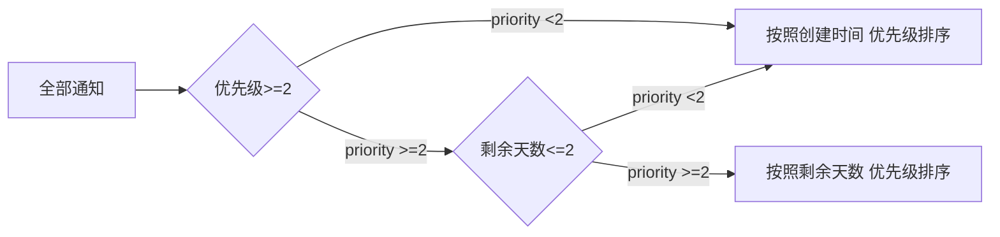

#### 需求场景




#### 数据准备

tips: create_time， expiration_time实际为时间戳，为了简化使用了datetime和直接数字剩余天数。

```sql
create table table_m
(
    id              int auto_increment primary key, 
    is_read         int      null,/* 1 已读， 0 未读*/
    create_time     datetime null,/*创建时间，实际库中为创建日期时间戳*/
    expiration_time int      null,/*剩余天数,实际库中为过期日期时间戳*/
    priority        int      null/*优先级*/
);

INSERT INTO table_m (id, is_read, create_time, expiration_time, priority) VALUES (1, 0, '2020-08-04 14:20:14', 2, 1);
INSERT INTO table_m (id, is_read, create_time, expiration_time, priority) VALUES (2, 0, '2020-08-04 15:20:14', 1, 2);
INSERT INTO table_m (id, is_read, create_time, expiration_time, priority) VALUES (3, 0, '2020-08-04 12:16:14', 1, 3);
INSERT INTO table_m (id, is_read, create_time, expiration_time, priority) VALUES (4, 0, '2020-08-05 13:20:14', 2, 4);
INSERT INTO table_m (id, is_read, create_time, expiration_time, priority) VALUES (5, 0, '2020-08-02 15:20:14', 3, 3);
INSERT INTO table_m (id, is_read, create_time, expiration_time, priority) VALUES (6, 0, '2020-08-02 15:20:14', 3, 4);
INSERT INTO table_m (id, is_read, create_time, expiration_time, priority) VALUES (7, 0, '2020-08-03 15:20:14', 3, 1);
INSERT INTO table_m (id, is_read, create_time, expiration_time, priority) VALUES (8, 0, '2020-08-02 15:20:14', 3, 1);
INSERT INTO table_m (id, is_read, create_time, expiration_time, priority) VALUES (9, 1, '2020-08-03 11:20:14', 4, 3);
INSERT INTO table_m (id, is_read, create_time, expiration_time, priority) VALUES (10, 1, '2020-08-04 16:20:14', 4, 1);
```


#### 问题分析

因为需要在 **一个** `sql`语句中写出 **两个条件分组** 并用 **两个不同排序方法** 的结果集。


#### 解决方案

##### 使用`union all`

使用`if(priority >= 2, if(expiration_time <= 2, 1, 2), 2)`计算语句来实现了多条件的分组字段计算。

意图为使用计算字段区分后，先后按照条件排序，并使用`union all`来实现有序结果集合并。但是在`mysql`中，最后的结果集不能保证两个有序集的拼接仍然有序。

```sql
select *
from (select id,
             expiration_time,
             priority,
             create_time
      from table_m
      where is_read = 0
        and if(priority >= 2, if(expiration_time <= 2, 1, 2), 2) = 1 
      order by expiration_time, priority desc) as view1

union all
select *
from (select id,
             expiration_time,
             priority,
             create_time
      from table_m
      where is_read = 0
        and if(priority >= 2, if(expiration_time <= 2, 1, 2), 2) = 2
      order by create_time, priority desc) as view2;
```


##### 使用更多计算字段

用更多的计算字段来实现不同分组，保持排序的稳定。

```sql
SELECT id,
       is_read,
       create_time,
       expiration_time,
       priority,
       if(priority >= 2, if(expiration_time <= 2, 2, 0), 0)                 AS first,
       if(priority >= 2, if(expiration_time <= 2, expiration_time, -1), -1) AS expiration_time_temp,
       if(priority >= 2, if(expiration_time <= 2, priority, -1), -1)        AS priority_temp
FROM table_m
where is_read = 0
ORDER BY first DESC, expiration_time_temp, priority_temp desc, create_time, priority DESC;
```

