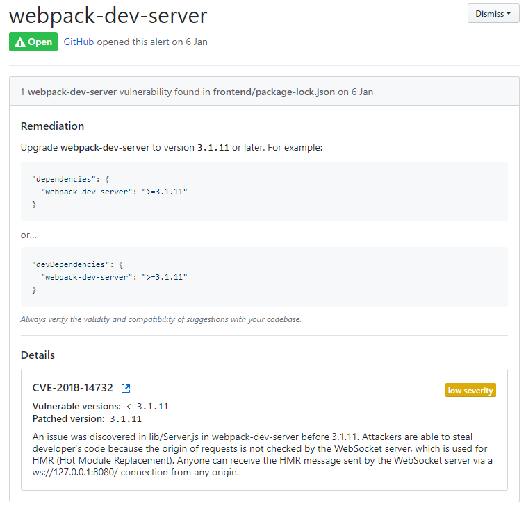

###  将vue-cli2生成的基于webpack3的项目升级成webpack4

#### 原因

使用的vue-cli2搭建的项目使用的是webpack3作为基本模板使用的。其所包含的webpack-dev-server的版本是2.9.* ，风和日丽的一天，github来了一个通知。


打开瞅了一眼：



本着强迫症的原则，升级一下webpack-dev-server 到3.*版本就好了，发现webpack3不支持。所以，要把项目升级到webpack4来解决这个问题。


#### 操作过程

1. 首先升级webpack,并安装webpack-cli。

   ```
   npm update -D webpack
   npm install -D webpack-cli
   ```

   在package.json中可以看到webpack的版本号已经升级了4.*的。直接使用npm run dev 命令会出现报错：

   ```
   > webpack-dev-server --inline --progress --config build/webpack.dev.conf.js
   
   internal/modules/cjs/loader.js:583
       throw err;
       ^
   
   Error: Cannot find module 'webpack/bin/config-yargs'
   ```

   这种情况多是webpack-dev-server与webpack的版本不兼容导致的。

2. 升级webpack-dev-server 

   ```
   npm update -D webpack-dev-server
   ```

   升级好后重新运行项目：

   ```
   > webpack-dev-server --inline --progress --config build/webpack.dev.conf.js
   
    10% building 1/1 modules 0 active(node:8888) DeprecationWarning: Tapable.plugin is deprecated. Use new API on `.hooks` instead
   (node:8888) DeprecationWarning: Tapable.apply is deprecated. Call apply on the plugin directly instead                                                                                   70% building 28/28 modules 0 activeD:\Code\tanwen\frontend\node_modules\html-webpack-plugin\lib\compiler.js:81
           var outputName = compilation.mainTemplate.applyPluginsWaterfall('asset-path', outputOptions.filename, {
                                                     ^
   
   TypeError: compilation.mainTemplate.applyPluginsWaterfall is not a function
   ```

   出现了新的报错，报错由于html-webpack-plugin版本不匹配导致。

3. 升级html-webpack-plugin

   ```
   npm update -D html-webpack-plugin
   ```

   升级后发现了新问题：

   ```
   Module build failed (from ./node_modules/eslint-loader/index.js):
   TypeError: Cannot read property 'eslint' of undefined
       at Object.module.exports (D:\Code\tanwen\frontend\node_modules\eslint-loader\index.js:148:18)
   
   You may use special comments to disable some warnings.
   Use // eslint-disable-next-line to ignore the next line.
   Use /* eslint-disable */ to ignore all warnings in a file.
   ```

   大多是由于升级webpack后，各种loader的不匹配导致的，当前报错是eslint导致，所以，按照要求去升级调整。

4. 升级eslint-loader

   ```
   npm update -D eslint-loader
   ```

   升级成功后，重启项目发现了vue-loader报错，这时候和修复eslint一样去修复它就好了。

   以下是升级使用中的常用清单：

   1. webpack
   2. css-loader
   3. file-loader
   4. html-webpack-plugin
   5. optimize-css-assets-webpack-plugin
   6. url-loader
   7. vue-loader
   8. vue-style-loader
   9. vue-template-compiler
   10. webpack-bundle-analyzer
   11. webpack-dev-server
   12. webpack-merge
   13. copy-webpack-plugin

5. 全部更新好后，发现弹出了几个警告：

   ```
   configuration
   The 'mode' option has not been set, webpack will fallback to 'production' for this value. Set 'mode' option to 'development' or 'production' to enable defaults for each environment.
   You can also set it to 'none' to disable any default behavior. Learn more: https://webpack.js.org/concepts/mode/
   ```

   这个需要我们去设置一下mode,mode可设三个值，分别为none，development或者production。

   去build目录下找到webpack.dev.conf.js

   ```
   const devWebpackConfig = merge(baseWebpackConfig, {
     + mode: 'development',
     module: {
       rules: utils.styleLoaders({ sourceMap: config.dev.cssSourceMap, usePostCSS: true })
     },
     // cheap-module-eval-source-map is faster for development
     devtool: config.dev.devtool,
   ```

   带有加号的就是添加设置mode的地方，也可以将webpack.prod.conf.js添加上mode:'production'。

再次重启项目就可以看到，项目可以启动了。基本上将项目升级成了webpack4。在dev-server下就可以正常启动项目了。

#### Tips

在此只是简单的让项目在dev-server上可以跑起来了，但是包括一些多余的废弃插件以及生产环境的配置修改都需要再深入的去研究和尝试。

以上学习引用了相关大佬的文章:

1. [vue项目升级webpack4指南](https://segmentfault.com/a/1190000014516899)
2. [vue cli 平稳升级webapck4](https://segmentfault.com/a/1190000014169887)